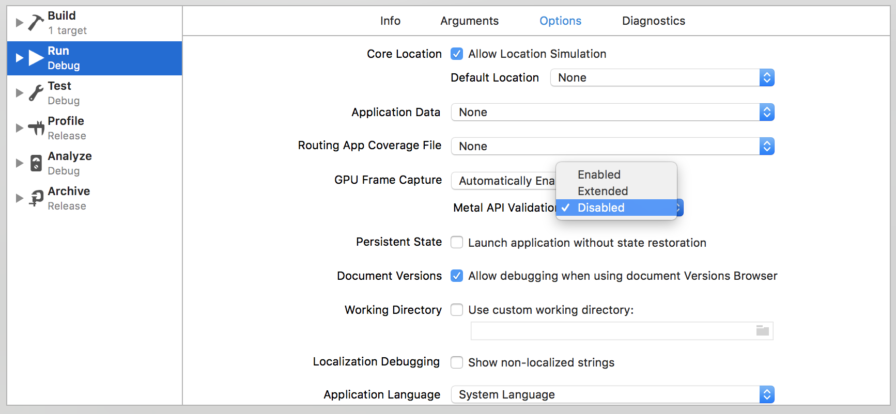

<p>
    
    <a href="https://github.com/handsomecode/UnityBuildKit/blob/master/LICENSE">
        
    </a>
</p>

# UnityBuildKit

UnityBuildKit is a command line tool that embeds a Unity project into an iOS application.  Both the Xcode and Unity project are automatically created, configured, and linked for immediate use after successful generation.

## Installation
`UnityBuildKit` requires Xcode 9, Swift 4, and Unity

### Make
```
git clone https://github.com/handsomecode/UnityBuildKit
cd UnityBuildKit
make
```

### Swift Package Manager
#### Use as a dependency
```
.package(url: "https://github.com/handsomecode/UnityBuildKit", from: "1.0.0"),
```

## Usage
### To generate a new project
Currently, Unity needs to be closed for this process to begin.

1. Create a top-level folder and navigate to it. This folder will contain all information about the Xcode and Unity projects.  (_Note: By default, the name of this folder will be the name of the Xcode and Unity projects._)
```
mkdir ExampleProject
cd ExampleProject
```

2. Create a configuration file named `ubconfig.json`

```
{
    "project_name": "", // Leaving this empty uses folder name by default
    "bundle_id": "is.handsome.UnityBuildKit",
    "unity_path": "<path_to_unity_app>", // "/Applications/Unity/Unity.app/Contents/MacOS/Unity"
    "unity_version": "2017.1.1f1",
    "unity_scene_name": "" // Leaving this empty uses folder name by default
}
```

3. Run 
```
$ UnityBuildKit generate
```

4. Once generation is completed, open the Xcode project.  Using the Build Scheme drop down menu, select Edit Scheme to edit your project's scheme (the scheme should be the same name as your project).  Select the Run action then the Options tab.  In the middle of the window, you will see `Metal API Validation` with a set of options in a drop down menu.  Change the current option to `Disabled`, as seen below:


#### Notes
- The generation script sets up the Unity project to build for the Device SDK.  These means that, if building for a simulator, there is a high probability that you will encounter build errors in Xcode.  Change the run destination to a physical device and the errors should go away.

- If building for a physical device, do not forget to set up your code signing.

### To refresh the Xcode project
After making updates to your Unity project, you'll need to refresh the files linked with the Xcode project.  Currently, Unity needs to be closed for this process to begin.

1. Navigate to the top-level folder
```
cd ExampleProject
```

2. Run
```
UnityBuildKit refresh
```

## Known Unity Version Compatibility
- 2107.1.f1

## Attributions
This tool is built using:
- [XcodeGen](https://github.com/yonaskolb/XcodeGen)
- [xcproj](https://github.com/xcodeswift/xcproj)

and the wonderful dependencies they bring with them.

Inspiration for building `UnityBuildKit` came after running into several problems while trying to [manually do this process](https://the-nerd.be/2015/11/13/integrate-unity-5-in-a-native-ios-app-with-xcode-7/) and reading over a [github issue](https://github.com/blitzagency/ios-unity5/issues/52) trying to resolve those problems.

## License

UnityBuildKit is licensed under the MIT license. See LICENSE for more info.